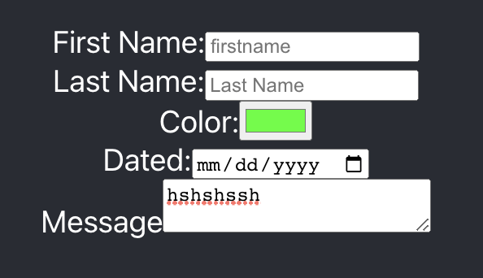

# Form Practice - React.js App
Building a react app with onchange functionality for HTML form for BocaCode C-10 in class practice.

## Demo Link
[See Link](https://form-practice-jt.web.app/)

## Covered In Class
* onChange
* Form Elements
* Controlled Components

## Basic Code

<label> FirstName
<input type="text"
</label>

